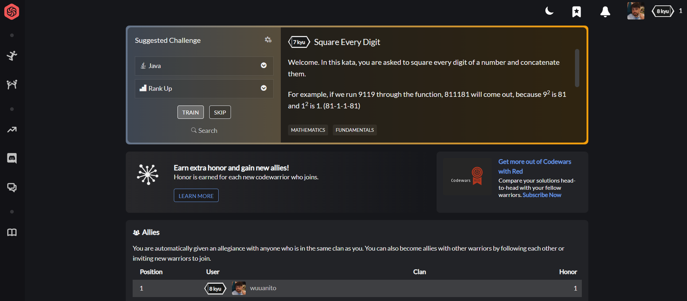

# CodeWars

¡Bienvenido/a a mi repositorio de CodeWars!

Este repositorio contiene soluciones a diversos desafíos de programación de la plataforma CodeWars. Soy un principiante apasionado en el mundo de la programación, ansioso por demostrar mis habilidades y aprender de este proceso desafiante.

## ¿Qué encontrarás aquí?

En este repositorio, encontrarás soluciones a una variedad de problemas de programación de CodeWars. Estas soluciones están escritas en varios lenguajes de programación y están diseñadas para mejorar mis habilidades en algoritmos y estructuras de datos.

## Objetivos

- Subir de rango en CodeWars y alcanzar niveles más altos de habilidad.
- Mejorar mis habilidades en algoritmos y estructuras de datos a través de la resolución de desafíos.
- Construir una cartera sólida de soluciones de programación para futuras referencias y demostración de habilidades.

## Acerca de Mí

Soy Juan Frauca, un principiante apasionado en el mundo de la programación con un gran deseo de aprender y mejorar mis habilidades. Este repositorio refleja mi dedicación y compromiso para convertirme en un desarrollador competente.

¡Espero que disfrutes explorando mis soluciones y que te unas a mí en este emocionante viaje de aprendizaje y crecimiento!
